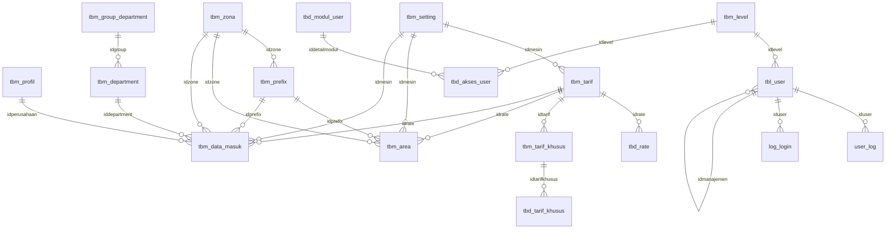

# Dokumentasi Database Relasional & Web Billing Telepon PABX

Database ini dirancang dan diimplementasikan secara **100% relasional** menggunakan MySQL InnoDB Engine, Foreign Key constraints, Indexes, dan terintegrasi dengan aplikasi web Laravel 12 untuk monitoring serta kalkulasi billing telepon secara *real-time*.

---

## 1. Akses Cepat

- **Web Billing Telepon:** [http://localhost/PABX](http://localhost/PABX) atau [http://localhost/PABX/public](http://localhost/PABX/public)
- **Halaman Relasi & Diagram ERD (Web):** [http://localhost/PABX/public/schema](http://localhost/PABX/public/schema)
- **phpMyAdmin Designer:** [http://localhost/phpmyadmin/index.php?db=pabx](http://localhost/phpmyadmin/index.php?db=pabx) *(Klik tab **Designer** untuk melihat garis relasi)*
- **File Dump SQL:** [`pabx.sql`](file:///c:/xampp/htdocs/PABX/pabx.sql)

---

## 2. Struktur 25 Tabel & Foreign Key Relasi

Tabel-tabel disusun agar saling tersambung (*referential integrity*):

### Rincian Relasi Kunci:
1. **Pencatatan Panggilan (`tbm_data_masuk`)**:
   - `iddepartment` &rarr; `tbm_department(id)` (Ekstensi dan staf pemanggil)
   - `idmesin` &rarr; `tbm_setting(id)` (Server/Mesin PABX)
   - `idzone` &rarr; `tbm_zona(idzone)` (Zona tujuan panggilan: Lokal, Seluler, SLJJ, SLI)
   - `idprefix` &rarr; `tbm_prefix(idprefix)` (Prefix nomor telepon operator/area)
   - `idrate` &rarr; `tbm_tarif(idtarif)` (Skema tarif yang diterapkan)
   - `idperusahaan` &rarr; `tbm_profil(id)` (Profil instansi/perusahaan)

2. **Organisasi & Ekstensi (`tbm_department`)**:
   - `idgroup` &rarr; `tbm_group_department(idgroup)` (Divisi/kelompok bagian)

3. **Tarif & Rate Waktu (`tbm_tarif`)**:
   - `tbd_rate(idrate)` &rarr; `tbm_tarif(idtarif)` (Rincian tarif jam sibuk / non-sibuk)
   - `tbm_tarif_khusus(idtarif)` &rarr; `tbm_tarif(idtarif)` (Diskon/promo hari libur)
   - `tbd_tarif_khusus(idtarifkhusus)` &rarr; `tbm_tarif_khusus(idharga)`

4. **Area & Penomoran (`tbm_area`)**:
   - `idprefix` &rarr; `tbm_prefix(idprefix)`
   - `idzone` &rarr; `tbm_zona(idzone)`
   - `idrate` &rarr; `tbm_tarif(idtarif)`
   - `idmesin` &rarr; `tbm_setting(id)`

5. **Hak Akses & Pengguna (`tbl_user`)**:
   - `idlevel` &rarr; `tbm_level(id)` (Role/jabatan)
   - `idmanajemen` &rarr; `tbl_user(iduser)` (Atasan/Supervisor)
   - `tbd_akses_user(idlevel)` &rarr; `tbm_level(id)`
   - `tbd_akses_user(iddetailmodul)` &rarr; `tbd_modul_user(iddetail)`
   - `user_log(iduser)` &rarr; `tbl_user(iduser)`
   - `log_login(iduser)` &rarr; `tbl_user(iduser)`

---

## 3. Fitur Aplikasi Web Billing

1. **Dashboard KPI Telepon:** Total tagihan (Rp), total panggilan (CDR), durasi bicara (Jam:Menit:Detik), serta ekstensi aktif.
2. **Filter & Pencarian CDR:** Berdasarkan rentang tanggal, ekstensi/departemen, zona tujuan, dan kata kunci nomor telepon.
3. **Simulasi Kalkulator Billing:** Masukkan nomor tujuan dan durasi, sistem akan otomatis mencocokkan prefix, mendeteksi zona, mengambil skema tarif, dan menghitung total biaya (pokok + PPN 11%).
4. **Input CDR Baru:** Fitur untuk mencatat panggilan baru langsung ke database dengan integritas relasi tabel.
5. **Schema Visualizer ERD:** Halaman interaktif untuk memeriksa seluruh daftar 25 tabel, jumlah baris data, dan peta foreign key.
